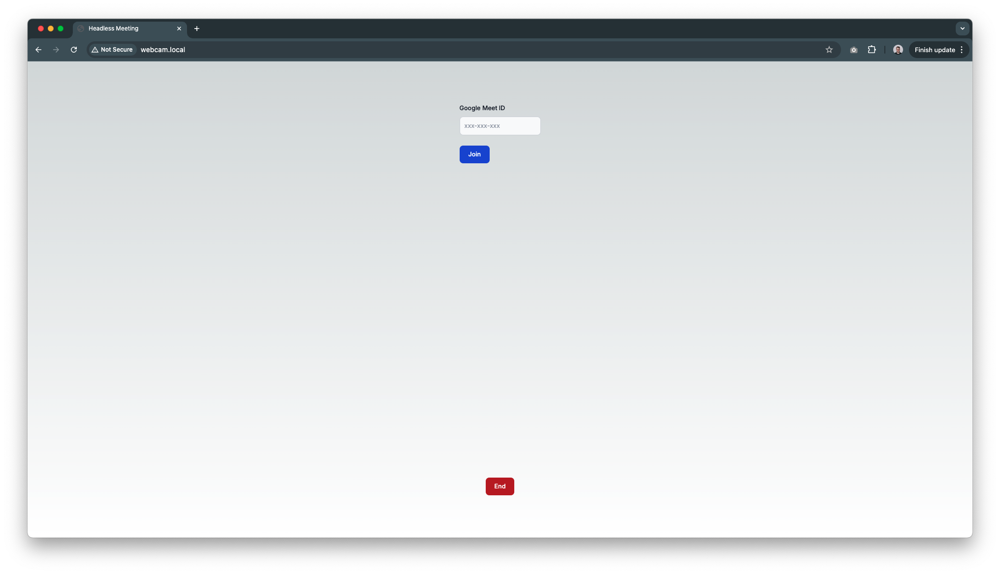
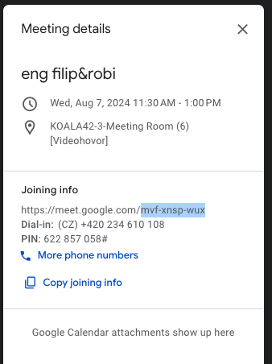
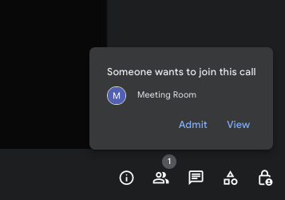
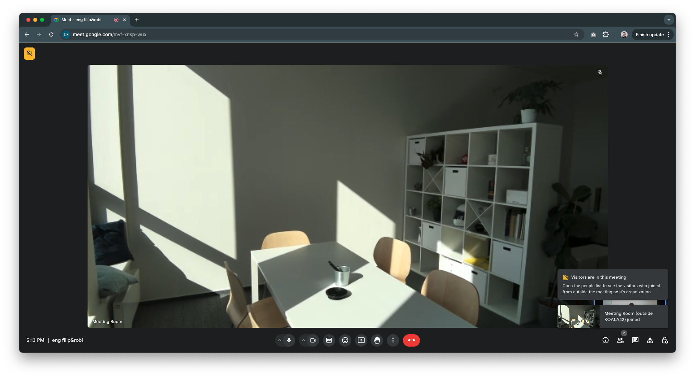

# Remote Webcam for Video Meetings



This project provides a convenient solution for connecting a webcam to video meetings remotely, using a Raspberry Pi positioned behind your TV. It eliminates the need to connect the webcam directly to your computer, offering greater flexibility and a streamlined setup.

## Problem

Connecting a webcam to a computer for video meetings can be cumbersome, especially if it's located near your TV. Also, it's not visually appealing with all the cables.

## Solution

This project addresses this challenge by introducing a Raspberry Pi as the intermediary device. You simply connect your webcam to the Raspberry Pi and access the web interface (webcam.local) from your computer on the same local network. Through this interface, you can provide the meeting ID and initiate the connection.

## Features

Remote Webcam Connection: Connect your webcam to the Raspberry Pi instead of your computer.
Headless Operation: The Raspberry Pi software runs in the background without requiring direct interaction.
Simple User Interface: The Next.js frontend allows you to easily enter meeting IDs and join meetings.
Current Support: Currently supports Google Meet.
Future Roadmap: Planned support for Zoom and Microsoft Teams.

## Architecture

The project employs two key components:

- Backend (BE): NestJS application that manages the Chromium browser and handles video meeting connections.
- Frontend (FE): Next.js application that provides the user interface for entering meeting IDs and initiating connections.

## Installation and Usage

The project includes scripts to simplify the installation and usage process:

install.sh: Installs required dependencies (Nginx, Node.js, npm), builds the frontend and backend applications, configures Nginx, and sets up a Linux service to run the project automatically on startup.
run.sh: Initiates the project (also used by the Linux service).

Clone the Repository:
```Bash
git clone https://github.com/<your-username>/remote-webcam-project.git
```

Installation:
```Bash
./install.sh
```

Usage:
Access `http://webcam.local` from your main computer's web browser.

Enter the meeting ID and join your video meeting (can take around 30s, depending on your raspberrypi).

_Note: To access the web interface, your main computer and Raspberry Pi must be on the same local network._





## Contributing

We welcome contributions to this project! Please refer to the contribution guidelines (create a separate document such as CONTRIBUTING.md) before submitting a pull request.

## License

This project is licensed under the MIT License.   

## Additional Information

This readme provides a high-level overview. Consider including more specific details about the project's functionalities, technical discussions, and potential limitations.
Remember to create separate documents for detailed installation instructions, configuration options, and contribution guidelines.
You can improve the readme's visual appeal by adding badges for supported technologies or links to relevant project resources (e.g., project website, issue tracker).
I hope this enhanced README.MD file effectively showcases your project's purpose, features, and usage instructions!
